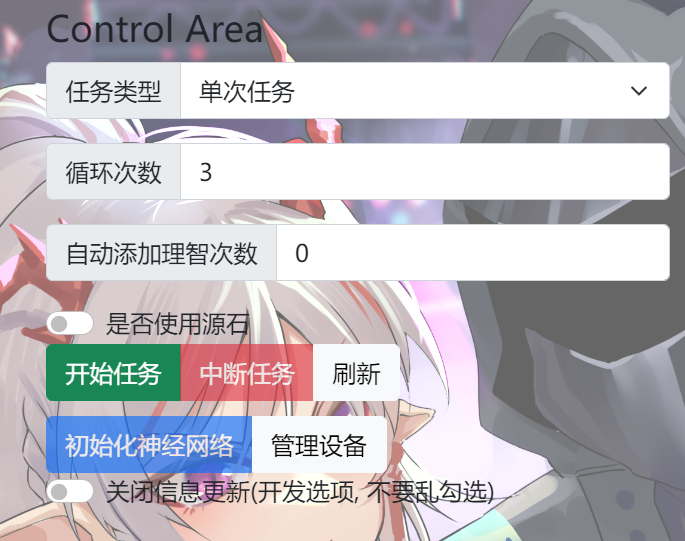
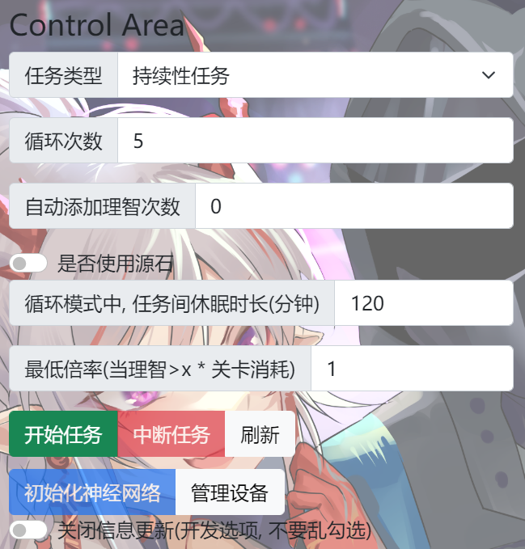

# 这里作为 ArkX 开箱即用教程

## 本教程的视频版本在 [https://www.bilibili.com/video/BV1NF411n7bJ/](https://www.bilibili.com/video/BV1NF411n7bJ/)

---

#### 第一步:

打开 [https://github.com/DuskXi/ArkX/releases/tag/v1.0.0](https://github.com/DuskXi/ArkX/releases/tag/v1.0.0)

下载文件 `ArkX.environment.zip`

#### 第二步:

在本地新建一个文件夹

将下载下来的文件解压缩到新建的文件夹中

#### 第三步:

双击start.bat

然后等待ArkX自动唤起浏览器

#### 第四步:

分别点击图中的初始化神经网络和设备管理

神经网络初始化会在点击之后自动进行

连接设备步骤如下:

如果使用的是模拟器，则需要先连接让adb连接模拟器的地址，比如说MuMu模拟器的连接地址就是:127.0.0.1:7555

点击刷新设备，如果你有设备连接在电脑上就会显示在表格中

在"选择设备"选项框中选择你想连接的设备随后点击"连接到设备xxxxxx"

到此为止, 已经完成了设备的连接

可以点击close

#### 第五步:

随后重点就来到了控制区域

第一行的"任务类型"中的单词任务代表运行任务结束后ArkX就不会再次运行, 而持续性任务则会在休眠指定时间后再次重新运行任务配置(用于全天候无人值守)

"循环次数"中的数字代表每次循环当前关卡的次数

"自动添加理智次数"代表ArkX自动使用理智液或者源石添加理智的次数(当理智不足时会执行)

"是否使用源石"则控制着是否在理智液用光时使用源石进行理智补充

在"持续性任务"选项被激活时

底下会多出两个选项, "休眠时长"和"最大启动倍率"

"休眠时长"代表每次单次任务结束后休眠的时间, 单位为分钟

"最大启动倍率"代表每次启动单次任务之前进行理智数检查，只有当前理智大于指定倍数于当前关卡消耗时才会启动(一般性设置为1)

至于"关闭信息更新"选项请不要乱勾选, 否则会导致页面的信息无法及时从后端更新